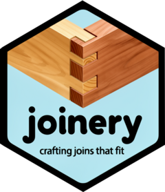

# Joinery 

[](https://opensource.org/licenses/MIT)

**Crafting joins that fit.**  
_Heuristic record linkage and fuzzy joins, designed with care._


## Overview

**Joinery** is a modern R package for **heuristic record linkage** and **fuzzy joining**.  
It’s inspired by the precision of traditional wood joinery. Each match crafted to fit, not forced.


Joinery provides a declarative, tidy interface for linking messy records across datasets using token-based heuristics, phonetic encoding, and (optionally) semantic similarity.  This package reimplements the main ideas from [Thorsten Doherr's search engine](https://github.com/ThorstenDoherr/searchengine/) to work within modern R-Workflows. 
It also expands it with the ability to combine heuristic index-based linkage with blocking strategies. It’s designed to scale from small data frames to large databases via DuckDB backends, with an S7 object model that makes it modular and extensible.

## Features

-  **Crafted Matching:** Token- and heuristic-based candidate retrieval that replaces rigid blocking.  
-  **Text Normalization:** Case folding, transliteration, and flexible tokenization (word, n-gram, phonetic).  
-  **Backend Flexibility:** Works with baseR backend or DuckDB for large datasets.  
-  **Transparent Evaluation:** Inspect similarity overlap, weights, and matching thresholds.


## Installation

```r
# Install the development version from GitHub
if (!requireNamespace("devtools", quietly = TRUE))
  install.packages("devtools")

devtools::install_github("edubruell/joinery")
```


